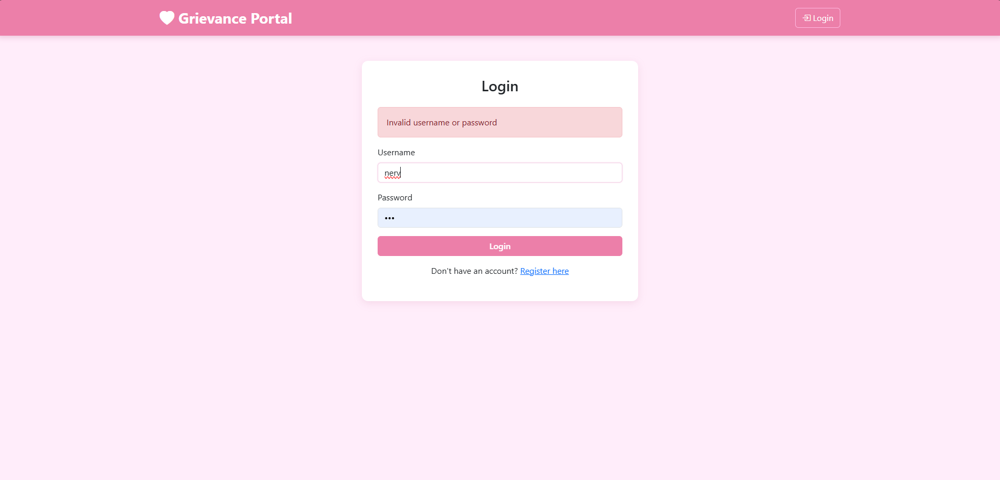
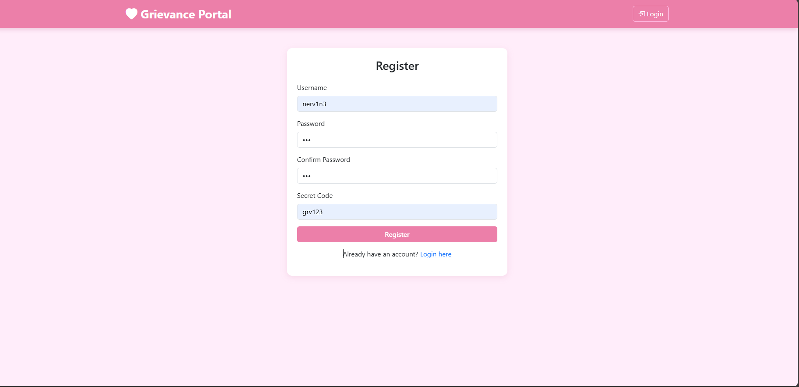
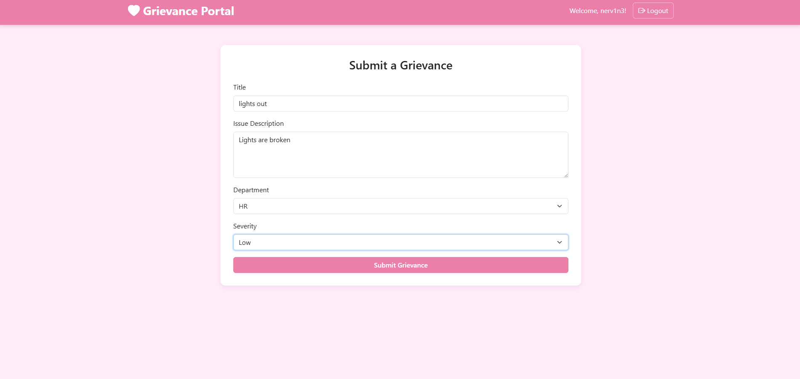
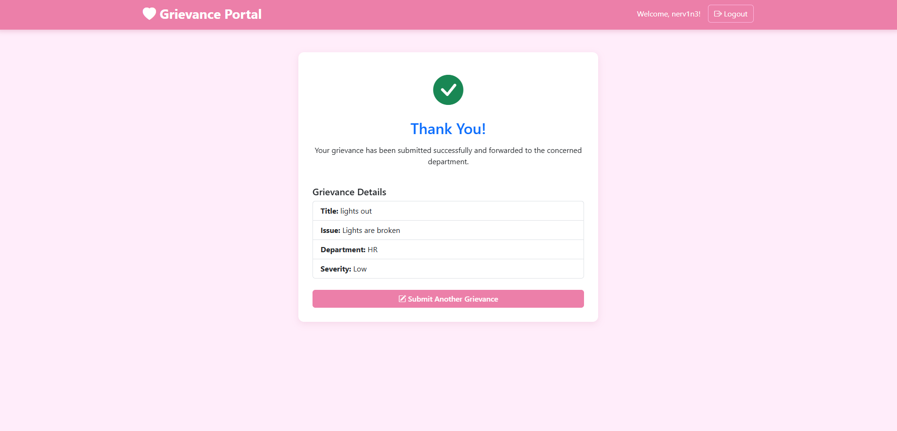

# Grievance Portal

This is a Flask-based web application for submitting and managing grievances. It supports user registration, login, grievance submission, and email notifications for new grievances.

## Features

- User registration with password hashing.
- Secure login and session management.
- Multi-platform support
- Submit grievances with details like title, issue, department, and severity.
- Email notifications sent to admin upon grievance submission.
- SQLite database to store user credentials securely.
- Simple and clean UI built with Bootstrap.

## Requirements

- Python 3.7+
- Flask
- Flask-Mail
- Flask-SQLAlchemy
- Werkzeug

## Installation

1. Clone the repository:
    ```bash
    git clone https://github.com/nervin3/grievance_portal
    cd https://github.com/nervin3/grievance_portal
    ```

2. Install dependencies:
    ```bash
    pip install -r requirements.txt
    ```

3. Set up environment variables (or edit app.py) with your email credentials for Flask-Mail:
    - `MAIL_USERNAME`
    - `MAIL_PASSWORD`

4. Run the application:
    ```bash
    python app.py
    ```

5. Open your browser and visit `http://127.0.0.1:5000/`

## Usage

- Register a new user.
- Login with your credentials.
- Submit grievances via the form.
- Admin receives email notifications for every new grievance.

## File Structure

- `app.py` - Main Flask application.
- `templates/` - HTML templates for the web pages.
- `display_user_table.py` - Displays the registered users along with hashed passwords.
- `users.db` - SQLite database file (auto-created).


---

## Images




